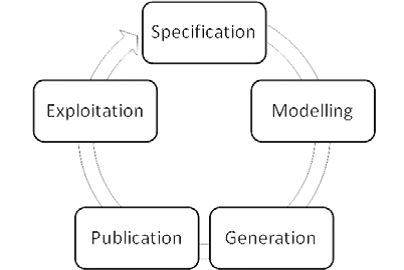
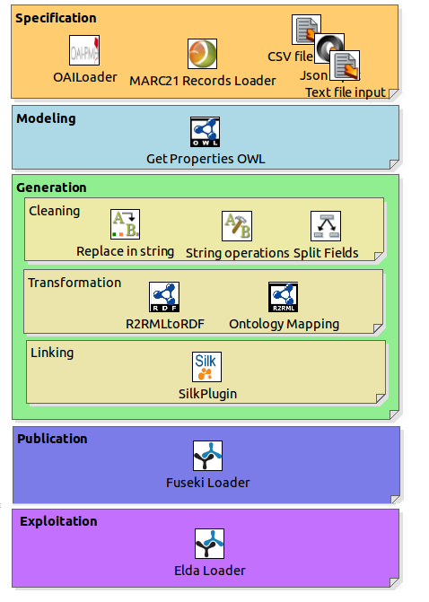

# LOD-GF #

Linked Open Data Platform: Solution to accomplish the life cycle management for publishing Linked Data on the Web.

## Introducción ##

Con el avanzar del tiempo un número  mayor de empresas e instituciones se han ido sumando a la iniciativa de Linked Open Data, atraídos  por las múltiples ventajas que esta tecnología aporta tanto en la reutilización, integración  y  el aprovechamiento superior de la información. Sin embargo, aunque esta tecnología ha ido creciendo constantemente, aun debe superar serios factores que afectan su adopción generalizada. Dentro de estos factores se encuentran la necesidad de conocimiento avanzado acerca de tecnologias semánticas, asi como la falta de herramientas que soporten el proceso de generación y publicación de Linked Data. Para afrontar esta problemática ha surgido LOD-GF,  el cual es un framework basado en [Pentaho Data Integration](http://community.pentaho.com/projects/data-integration/) para el soporte de la metodología de publicación de Linked Open Data. Gracias a que esta soportado por una herramienta ETL, este framework tiene un destacable capacidad para el procesado y acondicionamiento de datos, ademas de poder ser  empleado sobre multiples ámbitos de aplicación gracias a la gran felxibilidad que dispone para acceder a diferentes fuentes y formatos de datos.
                                                

## Descripción del Framework ##

LOD-GF es  amigable al usuario gracias a su interfaz gráfica y sus mecanicas *drag&drop* heredadas de Pentaho Data Integration (PDI). Para que el framework  pueda soportar el proceso de generación y publicación de LOD, adicionalmente a los plugins que cuenta (PDI) se han generado  plugins especializados que satisfacen las necesidades presentadas en cada una de las fases de la metodologia tal como se puede apreciar a continuación.
 

** Build Status **

The project guarantees a continuous Integration using Codeship.
